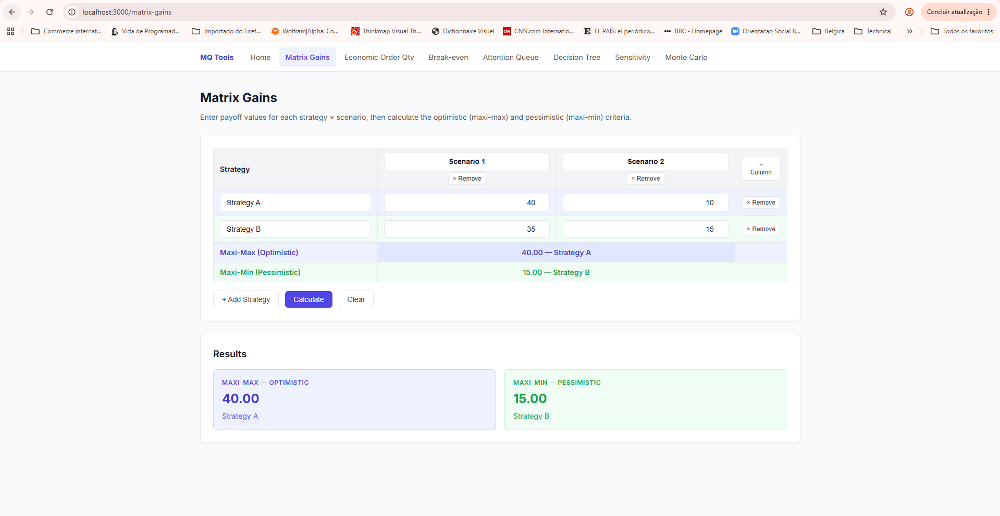
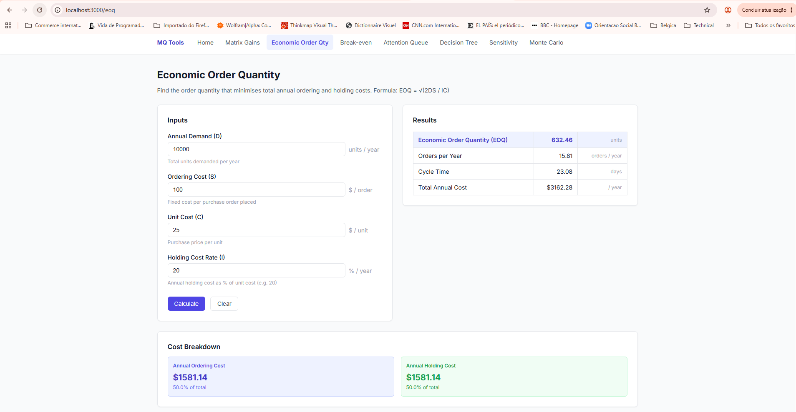
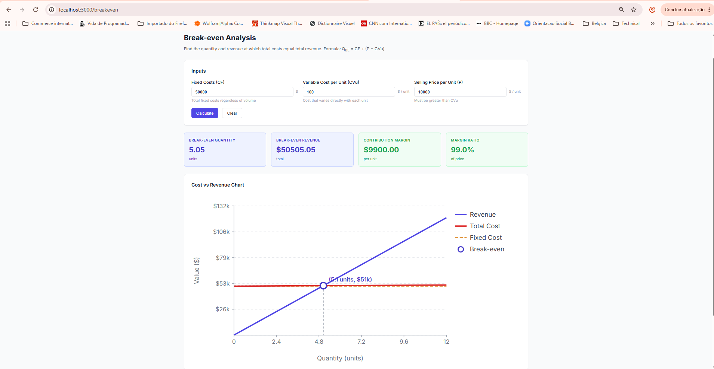
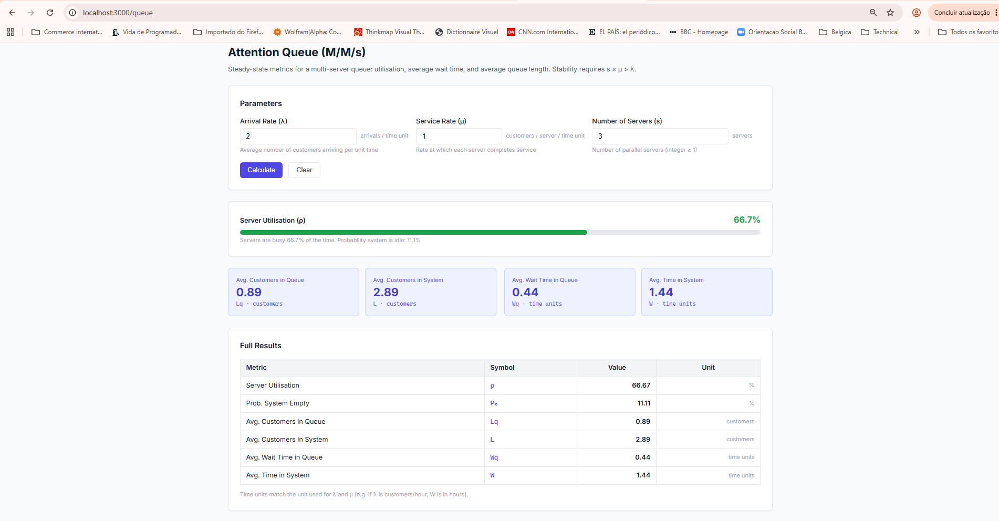
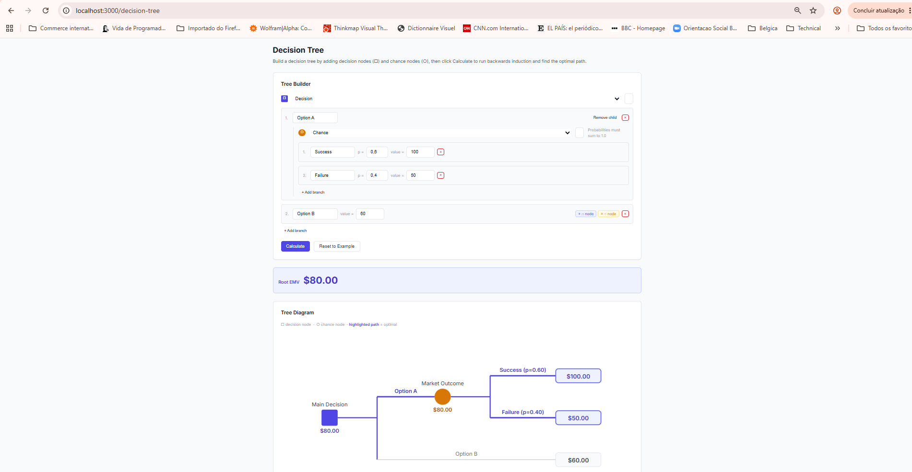

# Marketing Quantitative

A browser-first toolkit of seven quantitative analysis tools for operations research and decision-making. All calculations run in the browser with no server required. An optional Spring Boot backend adds a REST API and session persistence to PostgreSQL.

---

## Tools

### Matrix Gains — `/matrix-gains`

Evaluate strategies under uncertainty using the **maxi-max** (optimistic) and **maxi-min** (pessimistic) criteria. Enter payoff values for any number of strategies and scenarios — the result rows highlight the optimal strategy for each criterion.



---

### Economic Order Quantity — `/eoq`

Find the order quantity that **minimises total annual ordering and holding costs** using the formula `EOQ = √(2DS / IC)`. Returns EOQ, orders per year, cycle time, total annual cost, and a cost breakdown showing how ordering and holding costs balance at the optimum.



---

### Break-even Analysis — `/breakeven`

Find the **quantity and revenue at which total costs equal total revenue** using `Q_BE = CF / (P − CVu)`. Outputs break-even quantity, break-even revenue, contribution margin, and margin ratio, plus an SVG cost vs. revenue chart with the break-even point marked.



---

### Attention Queue (M/M/s) — `/queue`

Compute **steady-state metrics for a multi-server queue** given arrival rate λ, service rate μ, and number of servers s. Returns server utilisation ρ, average customers in queue (Lq) and system (L), average wait time in queue (Wq) and system (W). Warns when the stability condition `s × μ > λ` is violated.



---

### Decision Tree — `/decision-tree`

Build decision trees interactively with **decision nodes** (□) and **chance nodes** (○), then run **backwards induction** to find the optimal path by Expected Monetary Value (EMV). Results are shown as a labelled SVG diagram with the optimal path highlighted.



---

### Sensitivity Analysis — `/sensitivity`

Understand which inputs drive the most output variance by varying each one independently ±swing%. Results appear as a **tornado chart** (SVG) — bars sorted by impact magnitude — for both EOQ and Break-even models. Supports session save/load.

---

### Monte Carlo Simulation — `/montecarlo`

Assign a probability distribution (**Normal**, **Uniform**, or **Triangular**) to each model input and run up to 100,000 iterations to estimate the full output distribution. Returns a **CDF chart** (SVG) with P5/P95 reference lines and a summary statistics card (mean, std dev, P5–P95) for both EOQ and Break-even models. Supports session save/load.

---

## Architecture

```
marketing-quantitative/
├── frontend/                 # Next.js 14 (App Router) · TypeScript · React 18
│   ├── src/
│   │   ├── app/              # One route per tool (Server Components)
│   │   ├── components/       # Client components per tool + shared/
│   │   └── lib/              # Pure TS calculation modules (no framework deps)
│   └── tests/e2e/            # Playwright smoke tests
└── src/                      # Spring Boot 3.3 · Java 21
    └── main/java/.../
        ├── config/           # CORS + OpenAPI
        ├── controller/       # REST endpoints per tool
        ├── service/          # Pure calculation + session persistence services
        ├── entity/           # JPA entities (session tables)
        ├── repository/       # Spring Data repositories
        └── dto/              # Java 21 records (request / response / summary)
```

The `frontend/src/lib/` modules are framework-agnostic. The app works offline — the backend is optional.

---

## Prerequisites

| Dependency | Version | How to check |
|-----------|---------|-------------|
| Node.js | 18+ | `node -v` |
| Java | 21+ | `java -version` |
| Maven | 3.9+ | `mvn -version` |
| PostgreSQL | 15+ | `psql --version` |

PostgreSQL is only required when running the backend.

---

## Quick start

### Frontend only (no backend needed)

```bash
cd frontend
npm install
npm run dev
```

Open http://localhost:3000. All seven tools work immediately — calculations run in the browser.

### With backend (adds REST API + session history)

**1. Create the database**

Connect to your local PostgreSQL instance and create the database. Default connection assumes port `5433`, user `postgres`, password `admin` — adjust the flags to match your setup:

```bash
psql -U postgres -p 5433 -c "CREATE DATABASE marketingquantitative;"
```

**2. Set credentials** (skip if your setup matches the defaults below)

| Variable | Default | Description |
|----------|---------|-------------|
| `DB_USERNAME` | `postgres` | PostgreSQL username |
| `DB_PASSWORD` | `admin` | PostgreSQL password |
| `DB_PORT` | `5433` | PostgreSQL port |

```bash
export DB_USERNAME=your_user
export DB_PASSWORD=your_password
export DB_PORT=5432        # change if your Postgres runs on the standard port
```

**3. Start the backend** — Flyway runs all migrations automatically on startup

```bash
mvn spring-boot:run
```

**4. Start the frontend**

```bash
cd frontend
npm install
npm run dev
```

The frontend proxies `/api/*` requests to `http://localhost:8080` via `next.config.mjs`.

---

## API reference

Interactive docs: **http://localhost:8080/swagger-ui.html** (requires running backend)

| Endpoint | Method | Description |
|----------|--------|-------------|
| `/api/matrix-gains/calculate` | POST | Maxi-max and maxi-min for a payoff matrix |
| `/api/eoq/calculate` | POST | EOQ calculation (stateless) |
| `/api/eoq/sessions` | POST | Calculate + save to database |
| `/api/eoq/sessions` | GET | List 20 most recent EOQ sessions |
| `/api/eoq/sessions/{id}` | GET | Get a single EOQ session |
| `/api/breakeven/calculate` | POST | Break-even calculation (stateless) |
| `/api/breakeven/sessions` | POST / GET / GET `/{id}` | Session persistence |
| `/api/queue/calculate` | POST | M/M/s metrics (stateless) |
| `/api/queue/sessions` | POST / GET / GET `/{id}` | Session persistence |
| `/api/decision-tree/calculate` | POST | EMV via backwards induction |

Raw OpenAPI schema: GET /api-docs

---

## Database schema

Flyway manages all migrations in `src/main/resources/db/migration/`.

| Table | Purpose |
|-------|---------|
| `matrix_gains` | Payoff matrix sessions (header) |
| `matrix_gains_scenario` | Column labels |
| `matrix_gains_strategy` | Row labels |
| `matrix_gains_cell` | Payoff values |
| `eoq_session` | EOQ inputs + results |
| `breakeven_session` | Break-even inputs + results |
| `queue_session` | Queue inputs + results |

---

## Running tests

### Backend unit tests

```bash
mvn test
```

### Backend tests + JaCoCo coverage gate

```bash
mvn verify
```

Coverage thresholds: >= 80% line coverage on services, >= 70% on controllers, >= 70% branch coverage overall.

### Frontend unit tests (Jest + React Testing Library)

```bash
cd frontend
npm test
```

### Frontend coverage

```bash
cd frontend
npm run test:coverage
```

### End-to-end tests (Playwright)

```bash
cd frontend
npx playwright install chromium   # first time only
npm run test:e2e
```

Playwright starts `npm run dev` automatically if no server is listening on port 3000. The frontend dev server is sufficient — the backend is not required for E2E tests.

---

## Environment variables

| Variable | Default | Description |
|----------|---------|-------------|
| `DB_USERNAME` | `postgres` | PostgreSQL username |
| `DB_PASSWORD` | `postgres` | PostgreSQL password |

The database URL defaults to `jdbc:postgresql://localhost:5432/prixstrategie`. To override, pass `--spring.datasource.url=...` on the command line or edit `src/main/resources/application.yml`.

---

## Documentation

```
specs/
  main/
    requirements.MD     # Functional (FR-01-05) and non-functional (NFR-01-07) requirements
    tasks.MD            # Milestone task board (M0-M7)
    test.MD             # Test case catalogue (TC-01-07)
  use-cases/            # Per-tool use case documents
  contracts/            # REST API contract
PRD.MD                  # Full product requirements document
steering.MD             # Contributor and AI agent guidelines
```

---

## Tech stack

**Frontend** — Next.js 14 · React 18 · TypeScript 5 (strict) · Jest 29 · Playwright 1.47

**Backend** — Java 21 · Spring Boot 3.3 · Spring Data JPA · Flyway · Jakarta Bean Validation · springdoc-openapi 2.6

**Database** — PostgreSQL 15+ (runtime) · H2 (tests)